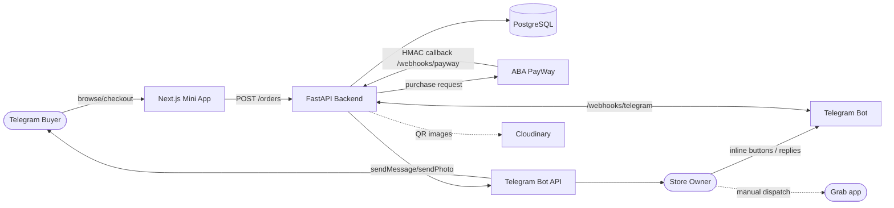
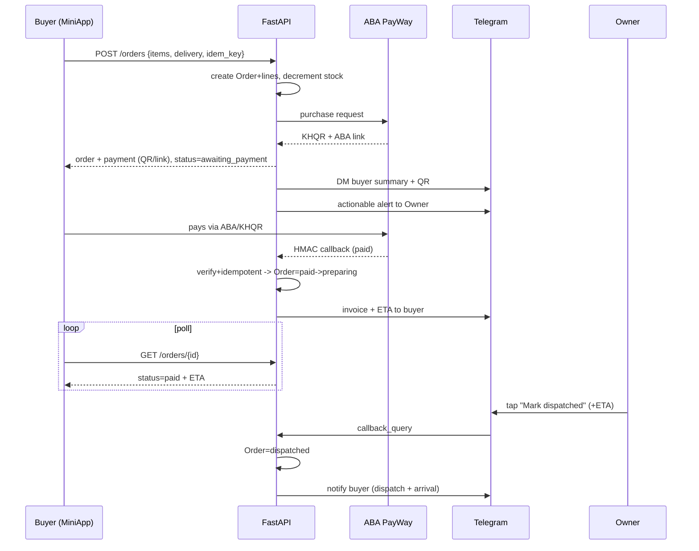
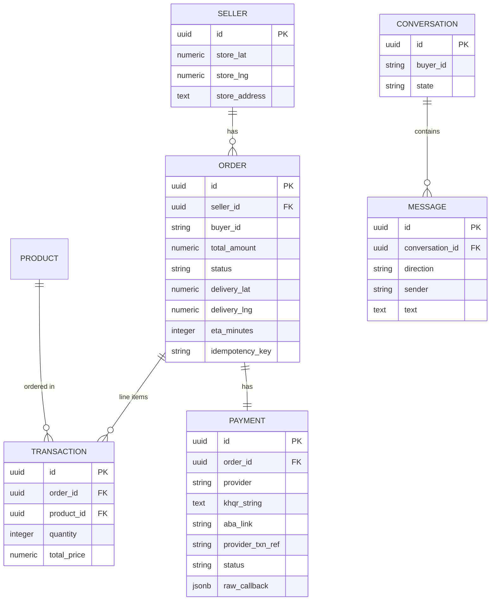
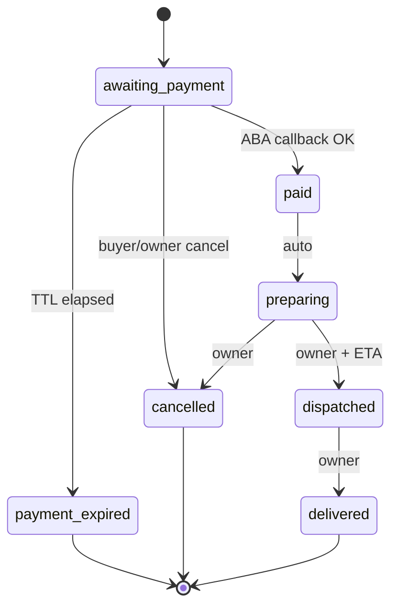
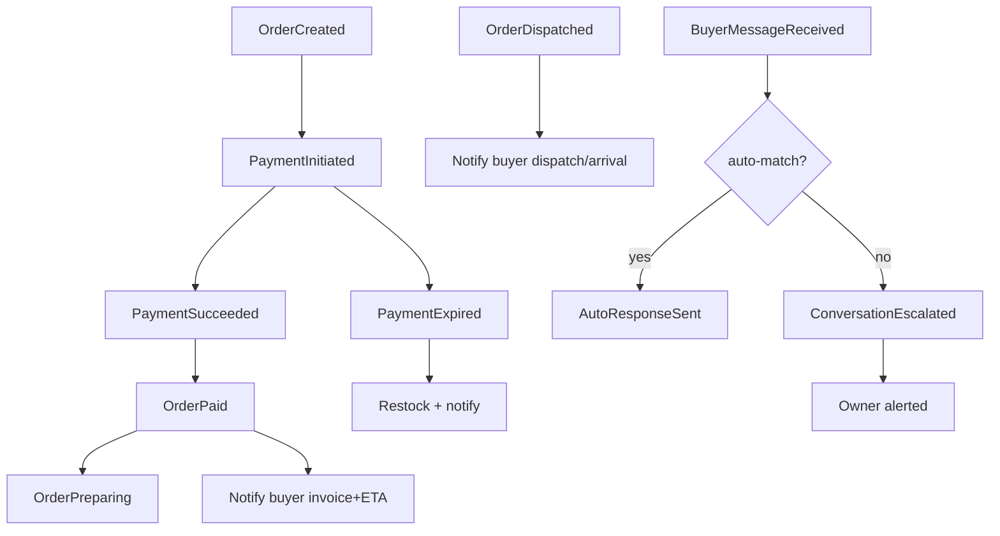

# EFDD — Conversational Checkout & Bot Commerce Console ("OmniBot")

> Enterprise Feature Design Document for OmniShop TMA.
> Stack: FastAPI + SQLAlchemy 2.0 async + Postgres + Alembic (Render) · Next.js 15 App Router + CSS Modules (Vercel) · Telegram Mini App.
> Keep the Production Runbook (Deliverables §10) findable before this ships.

## Feature summary

When a buyer checks out in the Telegram Mini App, the system creates one payable **Order**, requests **ABA PayWay**, and the bot DMs the buyer an order summary + **KHQR code + ABA pay link**. An ABA server callback confirms payment (source of truth); the bot then sends an **invoice + delivery ETA** computed from the buyer's pinned location. The **owner runs everything from their Telegram chat** — actionable order alerts with inline buttons, two-way messaging with buyers, dispatch/ETA updates — with the existing web admin as the secondary dashboard, and the existing keyword **auto-responder** handling tier-1 questions before escalating to the owner.

---

# === ENTERPRISE FEATURE DESIGN DOCUMENT (EFDD) ===

## 1. Feature Overview

- **Feature name (working title):** Conversational Checkout & Bot Commerce Console (codename **"OmniBot"**)
- **Description:** Turns the Telegram bot into the buyer's payment/support channel and the owner's operations console. Buyers pay via KHQR/ABA without leaving Telegram; the owner is notified, messages buyers, and manages fulfillment from the same chat. Closes the gap where today a checkout creates a silent `pending` `Transaction` and payment is "manual verification."
- **Where it lives:** Extends `frontend/src/app/checkout/page.tsx`, the `webhooks` and `transactions` routers, the `telegram`/`notifications`/`auto_responder` services, and the `admin/orders` web view. Introduces an `Order` aggregate above the existing `Transaction`.
- **Business Objective:** Increase paid-order conversion and give the single owner a real-time operational console instead of a passive dashboard.
- **Success Metrics / KPIs:** checkout→paid conversion rate; median time-to-payment; checkout abandonment rate; time-to-first-owner-response; auto-response deflection rate; on-time dispatch rate.
- **ROI Considerations:** *Revenue* — recovered abandoned checkouts + faster payment closure (removing the "manual verification" friction is the highest-leverage change). *Cost* — auto-chat deflects routine "price/stock?" questions; owner isn't tethered to a dashboard.
- **Operational Benefits:** One actionable alert per order; fulfillment state tracked in-system; buyer comms logged and auditable.
- **Compliance & risk-reduction impact:** Payment status driven by a signed webhook, not a human guess — eliminates "did they pay?" disputes. No card data on your servers (ABA-hosted). New geolocation PII isolated to the owner.

## 2. Enterprise Benchmark Analysis

| Product | Workflow design | Permission model | UX pattern | Automation | Adopt? |
|---|---|---|---|---|---|
| **Stripe Payment Links + webhooks** | Hosted link/QR; webhook is source of truth for paid; idempotency keys | Restricted keys + webhook signing secret | One-click QR, never expires | Webhook → fulfillment | **Adopt** webhook-as-truth, signed callback, idempotency. ABA PayWay maps 1:1. |
| **Telegram native Bot Payments** | In-chat invoice, provider relays | Provider token via BotFather | Lowest-friction pay-in-chat | `pre_checkout_query` ≤10s | **Skip native invoice** — Stars are digital-only and your rail is KHQR/ABA. Borrow the in-chat summary UX. |
| **Conversational inbox + bot→human handoff** (Shopify Inbox, HubSpot, Intercom, ServiceNow Virtual Agent) | Bot tier-1 → handoff w/ context; conversation state + assignee + first-response SLA | Agent/role scoping | Canned replies, snooze/close | Bot deflection then escalate | **Adopt** handoff state machine + canned replies (`AutoResponse`). **Skip** multi-agent routing — one owner. |
| **Actionable order notifications** (Shopify alerts, ServiceNow actionable notifications) | Event → push w/ inline actions | Recipient-scoped | Buttons on the alert itself | Event-driven | **Adopt** — Telegram inline keyboards make `notify_new_order` actionable. Highest-leverage UX move. |

**Net:** webhook-as-truth payment, idempotent callbacks, actionable inline-keyboard alerts, bot→owner handoff reusing `AutoResponse`. Deliberately **not** building multi-agent routing, in-app card handling, or native Telegram invoices.

## 3. Domain-Driven Design Analysis

- **Domain:** Single-seller e-commerce / conversational commerce.
- **Subdomains:** Ordering & Payments (core), Conversation/Support (supporting), Fulfillment/Delivery (supporting).
- **Bounded Contexts:** `Ordering` (Order, Transaction line, Payment), `Messaging` (Conversation, Message, AutoResponse), `Fulfillment` (delivery location, ETA, dispatch).
- **Aggregate Roots:** **`Order`** (owns its `Transaction` line items, its `Payment`, and its delivery/fulfillment state) and **`Conversation`** (owns its `Message`s).
- **Domain Events:** `OrderCreated`, `PaymentInitiated`, `PaymentSucceeded`, `PaymentFailed`, `PaymentExpired`, `OrderPaid`, `OrderPreparing`, `OrderDispatched`, `OrderDelivered`, `OrderCancelled`, `BuyerMessageReceived`, `AutoResponseSent`, `ConversationEscalated`, `OwnerReplied`.
- **Ownership boundaries:** Stock lives with `Product` (mutated only through Order transitions). Payment truth lives with `Payment`, mutated only by the ABA callback or reconciliation job — never by a UI write. Owner identity is the single `ADMIN_TELEGRAM_ID`.

## 4. Fit With Existing System

- **Touches:** `checkout/page.tsx` (collect location, call `/orders`, poll status), `webhooks.py` (add PayWay callback + `callback_query` handling), `transactions.py` (Transaction → line item; status logic moves up to Order), `notifications.py` (inline keyboard), `telegram.py` (sendPhoto QR, inline keyboards, answerCallbackQuery), `admin/orders/page.tsx` (show payment + delivery).
- **Depends on:** `Seller`, `Product`, `Transaction`, `AutoResponse` models; `find_response` auto-responder; JWT auth via `deps.py`; `Base` (UUID/created_at/updated_at).
- **Conventions followed:** routers in `app/api/v1/<resource>.py` mounted via `router.py`; SQLAlchemy 2.0 typed models with `CheckConstraint`s and `selectin`; Pydantic v2 schemas in `app/schemas/`; logic in `app/services/`; `HTTPException(status, detail)` errors; background tasks for out-of-band sends; CSS-Modules admin pages; `lib/api.ts` typed client + hooks on the frontend.

## 5. Enterprise Security & Permissions Review

- **RBAC:**
  - **Owner (`role=admin`, `telegram_id == ADMIN_TELEGRAM_ID`):** list/view all orders, change order status (dispatch/deliver/cancel), set/override ETA, message any buyer, configure auto-responses. Cannot fake payment status (no write path to `Payment.status`).
  - **Buyer (`role=buyer`):** create an order from their cart, view/poll **only their own** order + payment, message the bot. Cannot list others' orders or change status.
  - **Bot/System (non-human):** auto-replies, payment generation, ABA callback processing, reconciliation.
- **ABAC:** `buyer_id == order.buyer_id` for read; messaging restricted to `(owner ↔ that order's buyer)`; ABA callback authorized by HMAC over the raw body, not by JWT.
- **Tenant isolation:** Single-tenant per deployment (one Seller). Buyer-scoped reads filter by `buyer_id` from JWT `sub` (same pattern as `get_transaction`).
- **Data classification:** Sensitive — `Order.delivery_address`, `delivery_lat/lng` (geolocation PII), `Payment.provider_txn_ref`, `Payment.raw_callback`. Non-sensitive — product/price/quantity. **No PAN/card data stored.**
- **Audit:** Append-only `Message`; `Order` status transitions logged with actor + timestamp; every `Payment` callback persisted in `raw_callback`.
- **Encryption:** TLS in transit (Render). At rest = Postgres-level. Location + payment refs excluded from app logs.
- **API-layer authz:** `get_current_user` / `require_admin` (existing) + new `require_order_access(order_id)` (admin-or-owning-buyer, mirrors `get_transaction`).
- **UI-layer authz:** web admin gated by `is_admin`; buyer order screen only renders own order. UI checks are usability, not the boundary.
- **Permission edge cases:** spoofed ABA HMAC → 401, no state change; buyer polling another's order id → 403; owner messaging closed/cancelled order → allowed but flagged.

## 6. Data Model Changes

**New: `Order`** (aggregate root)

| Field | Type | Constraints / Notes |
|---|---|---|
| id | UUID | PK (from Base) |
| seller_id | UUID | FK→seller.id, indexed |
| buyer_platform | String(20) | `telegram` (default) |
| buyer_id | String(100) | buyer telegram_id, **indexed** |
| total_amount | Numeric(10,2) | ≥ 0 |
| currency | String(3) | `USD`/`KHR`, default `USD` |
| status | String(20) | enum: `awaiting_payment, paid, preparing, dispatched, delivered, cancelled, payment_expired`; **indexed** |
| delivery_address | Text | nullable, **sensitive** |
| delivery_lat | Numeric(9,6) | nullable, **sensitive** |
| delivery_lng | Numeric(9,6) | nullable, **sensitive** |
| distance_km | Numeric(6,2) | nullable, computed |
| eta_minutes | Integer | nullable, computed/owner-override |
| dispatch_at | DateTime(tz) | nullable |
| idempotency_key | String(64) | nullable, **unique** (dedupe double-submit) |

**New: `Payment`**

| Field | Type | Constraints / Notes |
|---|---|---|
| id | UUID | PK |
| order_id | UUID | FK→order.id, **unique** (1:1), indexed |
| provider | String(20) | `aba_payway` (enum-extensible) |
| amount | Numeric(10,2) | ≥ 0 |
| currency | String(3) | `USD`/`KHR` |
| khqr_string | Text | nullable |
| aba_link | String(500) | nullable |
| provider_txn_ref | String(100) | nullable, **unique**, **indexed** (idempotency anchor) |
| status | String(20) | `initiated, paid, failed, expired` |
| paid_at | DateTime(tz) | nullable |
| raw_callback | JSONB | nullable, **sensitive** |

**New: `Conversation`**

| Field | Type | Constraints / Notes |
|---|---|---|
| id | UUID | PK |
| buyer_platform | String(20) | `telegram`/`instagram` |
| buyer_id | String(100) | **indexed**; unique with platform |
| state | String(20) | `bot, awaiting_owner, owner_handling, closed` |
| last_message_at | DateTime(tz) | indexed (sort) |

**New: `Message`**

| Field | Type | Constraints / Notes |
|---|---|---|
| id | UUID | PK |
| conversation_id | UUID | FK→conversation.id, **indexed** |
| direction | String(10) | `inbound`/`outbound` |
| sender | String(10) | `buyer`/`owner`/`bot` |
| text | Text | not null |
| telegram_message_id | String(50) | nullable |

**Modified: `Transaction`** — add `order_id` UUID FK→order.id (indexed, nullable for backfill window then enforced). `buyer_*`/`status` retained for backward-compat, but Order is now authoritative.
**Modified: `Seller`** — add `store_lat` Numeric(9,6), `store_lng` Numeric(9,6), `store_address` Text (ETA origin).

**Relationships:**
- `Seller` has many `Order`; `Order` belongs to `Seller`.
- `Order` has many `Transaction` (line items, via `order_id`); `Transaction` belongs to `Order` and to `Product`.
- `Order` has one `Payment` (via `order_id`, unique); `Payment` belongs to `Order`.
- `Conversation` has many `Message`; `Message` belongs to `Conversation`.

**Indexes & why:** `order.buyer_id` (buyer polling/list), `order.status` (admin filter + reconciliation scan), `payment.provider_txn_ref` (callback lookup + idempotency), `payment.order_id` unique (1:1), `transaction.order_id` (load lines), `conversation.buyer_id`/`last_message_at` (inbox lookup + sort), `message.conversation_id` (history).

## 7. API Design

- **`POST /api/v1/orders`** — Auth: buyer. Body: `{ items:[{product_id, quantity}], delivery:{lat,lng,address?}, idempotency_key }`. Response: `{ order, lines[], payment:{khqr_string, aba_link, status} }`. Pagination N/A. Rate limit: shares 60/min/IP bucket. Caching N/A. Replaces the checkout loop of `POST /transactions`; creates Order+lines, decrements stock atomically, calls PayWay, returns QR/link. Idempotent on `idempotency_key`.
- **`GET /api/v1/orders/{id}`** — Auth: role-restricted (admin or owning buyer). Response: order + lines + payment + delivery status. **Buyer polling** (~3–5s, hard stop). `Cache-Control: no-store`.
- **`GET /api/v1/orders`** — Auth: admin. Query: `status_filter, limit, offset`. Response: `{items,total}`. **Pagination: yes** (mirrors `list_transactions`).
- **`PATCH /api/v1/orders/{id}/status`** — Auth: admin. Body: `{ status, eta_minutes?, dispatch_at? }`. Drives §8; restocks on cancel/expire (reuse existing logic); emits buyer notification on dispatch/deliver.
- **`POST /api/v1/orders/{id}/payment/refresh`** — Auth: owning buyer or admin. Re-queries PayWay (missed-callback fallback). Rate limit ≤5/min.
- **`POST /api/v1/webhooks/payway`** — Auth: **HMAC signature** (no JWT). 200 after verify. **Idempotent** (no-op if `Payment.status==paid`). Source of truth. **Excluded from per-IP rate limiter** (bypass list in `rate_limiter.py` alongside `/health`).
- **`POST /api/v1/webhooks/telegram`** (modify) — also handles **`callback_query`** (owner inline-button presses → order transition + `answerCallbackQuery`) and routes buyer messages into `Conversation` (auto-respond or escalate). Owner replies relayed to the buyer.
- **`POST /api/v1/conversations/{id}/messages`** — Auth: admin. Owner sends a message to a buyer from the web admin (parity with the bot button). `GET` variant lists history (paginated).

## 8. Enterprise Workflow & State Machine Design

**Order (fulfillment) state machine** — *applicable.*
- **States:** `awaiting_payment → paid → preparing → dispatched → delivered`; side exits `cancelled`, `payment_expired`.
- **Transitions:** `awaiting_payment`—(ABA callback success)→`paid`; `awaiting_payment`—(TTL, default 30 min)→`payment_expired` (restock); `awaiting_payment`—(buyer/owner cancel)→`cancelled` (restock); `paid`→`preparing` (auto); `preparing`—(owner "Mark dispatched"+ETA)→`dispatched`; `dispatched`—(owner "Mark delivered")→`delivered`. `delivered/cancelled/payment_expired` terminal.
- **Approval paths:** none (single owner).
- **Escalation/Timeout:** `awaiting_payment` TTL → expire + restock + notify; optional reminder DM at T+10 min.
- **Retry:** ABA purchase retries (httpx); callback processing idempotent.
- **Exception handling:** ETA calc failure → owner alerted, order proceeds with null ETA (manual). PayWay down at checkout → manual-verification fallback (feature-flag/back-compat path).

**Conversation state machine** — *applicable.* `bot → awaiting_owner` (no auto-match or buyer asks for human) `→ owner_handling` (owner replies) `→ closed`; reopens on new inbound.

## 9. UI/UX Flow

- **Buyer:** Catalogue → cart → **Checkout** now collects delivery location (Telegram share / map pin) → **Confirm Order** → screen enters **`awaiting payment`** (QR + "Pay with ABA" + manual "I've paid / refresh"), **polling** `GET /orders/{id}` → on `paid`, success card shows invoice + ETA. Bot DMs the same summary in parallel.
- **Owner:** primary surface is **Telegram** — actionable alert (`View / Message buyer / Mark dispatched`), inline reply relay, ETA override. Web **admin/orders** is secondary full-history view with payment + delivery columns.
- **Components — reused:** `LoadingSkeleton`, `EmptyState`, checkout success card, `StatusBadge`, `Header`, `QuantitySelector`. **New:** `DeliveryLocationPicker`, `PaymentQRPanel` (QR + ABA button + poll state), expanded `StatusBadge` states, admin order-detail row.
- **States handled:** loading (skeleton), empty (empty cart), error (existing alert + payment-failed), success (paid + ETA).

## 10. Integration Strategy

- **Internal:** `payway` ↔ Order/Payment; `telegram` ↔ notifications + relay; `auto_responder` ↔ escalation; `distance` ↔ Order ETA.
- **External:**
  - **ABA PayWay** — REST purchase (`app/services/payway.py`); HTTPS; HMAC **callback** into `/webhooks/payway`. Down at checkout → manual fallback + retry queue.
  - **Telegram Bot API** — extend `telegram.py`: `sendPhoto` (QR), `inline_keyboard`, `answerCallbackQuery`. Existing retry/backoff reused. Down → retried; owner alert best-effort.
  - **Grab** — **manual, no API** in v1; owner dispatches in the Grab app and records dispatch/ETA.
- **Event contracts:** in-process domain events (§3); no external bus (single Render process).
- **Webhooks:** PayWay callback (inbound, HMAC); Telegram updates (inbound, secret token).
- **Synchronization:** **reconciliation job** queries PayWay for `awaiting_payment` orders older than N minutes to catch missed callbacks; idempotent against the callback path.

## 11. Edge Cases & Validation Rules

- Double callback / replay → idempotent on `provider_txn_ref` + `Payment.status` guard.
- Callback before order committed → retries / reconciliation catch it.
- Buyer pays after expiry → reconciliation marks paid; if restocked + sold out, flag owner.
- Stock sold out between add-to-cart and confirm → existing stock check 400; no Order.
- Partial cart, one line invalid → whole Order rejected (atomic).
- Buyer shares no location → allow order, ETA null, owner sets manually.
- Spoofed ABA HMAC → 401, no state change, logged as security event.
- Owner messages a buyer who blocked the bot → Telegram 403; surface "couldn't deliver".
- **Validation (client + server):** `quantity ≥ 1`; `total_amount` recomputed server-side; lat/lng range-checked; `idempotency_key` ≤ 64; status transitions validated against the allowed map (reject illegal jumps).

## 12. Reliability & Performance Requirements

- **Availability:** best-effort single-instance (Render); SLO ~99% checkout/callback; correctness > uptime.
- **Recovery/retry:** httpx retry (existing) + reconciliation for missed callbacks.
- **Idempotency:** Order creation (`idempotency_key`), payment callback (`provider_txn_ref` + status guard), status transitions (re-apply same status = no-op).
- **Failure recovery:** PayWay down → manual fallback; Telegram down → retry + best-effort; DB error → rollback via `get_db`.
- **DLQ / compensating txns / replay:** no external queue in v1 — **reconciliation job is the compensating mechanism**; `Payment.raw_callback` enables manual replay. Use a **fresh DB session** in callback/background workers (the request session may be closed/committed by then — current `BackgroundTasks` usage in `create_transaction`/webhooks reuses it, which is the footgun to avoid here).
- **Rate limiting:** `/webhooks/*` bypass the per-IP limiter; buyer polling capped client-side.

## 13. Enterprise Observability

- **Business metrics:** orders_created, conversion (paid/created), median time-to-payment, abandonment, auto_response_deflection_rate, escalations, on-time_dispatch_rate.
- **Technical metrics:** payway_request_latency, payment_callback_count{result}, callback_signature_failures, eta_calc_failures, telegram_send_failures, reconciliation_mismatches.
- **Logs:** audit (transitions w/ actor), security (bad HMAC / 403 cross-buyer), operational (provider errors) — **excluding** location + payment refs. Builds on stdlib `logging`.
- **Tracing:** none today; recommend a correlation-id per order threaded checkout→payway→callback→notification.
- **Alerts:** callback_signature_failure spike; `awaiting_payment` backlog (> TTL); reconciliation_mismatch > 0; telegram_send_failure rate. (No alerting backend today — start log-based + daily reconciliation summary DM to the owner.)

## 14. Scalability Review

- **Expected scale:** one seller, tens of orders/day, spiky around promos; growth dominated by `Message` rows.
- **Classification:** **Small Business.**
- **If growth exceeds capacity:** move `BackgroundTasks` → real worker/queue (Celery/RQ/Arq + Redis) for callbacks/notifications; replace in-memory rate limiter with Redis (per-process today, breaks under >1 instance); index/partition `Message`; introduce Google Distance Matrix behind the existing distance interface; add Prometheus/OTel.

## 15. Production Readiness Review

- **Horizontally scalable?** Mostly — *except* in-memory rate limiter + `BackgroundTasks` are per-process; need Redis/worker before multi-instance.
- **Observable?** Partially — logs + business metrics; no tracing/alerting backend yet.
- **Auditable?** Yes — append-only `Message`, persisted `raw_callback`, logged transitions.
- **Secure?** Yes — HMAC callbacks, secret-token webhooks, buyer-scoped reads, no card data, location out of logs.
- **Fault tolerant?** Yes for payment correctness (idempotent + reconciliation); best-effort notifications.
- **Compliant?** No formal program; PII handled responsibly (TLS, scoping, log exclusion).
- **Multi-tenant?** Single-tenant by design; buyer isolation enforced.
- **Survive downstream failure?** Yes — PayWay down → manual fallback; Telegram down → retry; reconciliation closes payment gaps.

## 16. Rollout Plan

- **Feature flag:** **Yes** — env-gated (`PAYMENTS_ENABLED` / `ABA_PAYWAY_*` presence). Off → today's manual-verification flow unchanged.
- **Migration:** **Yes** — first real Alembic migration: create `Order`/`Payment`/`Conversation`/`Message`, add `Transaction.order_id`, `Seller.store_*`; **backfill** existing `pending` transactions into synthetic single-line Orders; then enforce `order_id` NOT NULL.
- **Backward compatibility:** old `POST /transactions` kept (deprecated), wrapped to create a one-line Order; existing admin/orders view keeps working.
- **Deployment strategy:** phased — migrate (additive) → deploy with flag off → enable for owner's test orders → enable for all. (Full version: Deliverables §7.)
- **Rollback triggers:** callback signature-failure spike, payment status mismatches, or checkout error-rate jump → flag off, revert to manual. (Full version: Deliverables §8.)

## 17. Implementation Checklist

- **Phase 1 — Data & API:** Alembic migration (entities, FK, `Seller` coords, backfill, indexes); `Order`/`Payment`/`Conversation`/`Message` models + Pydantic schemas; `POST/GET /orders`, `PATCH /orders/{id}/status`, payment refresh.
- **Phase 2 — UI:** `DeliveryLocationPicker` + `PaymentQRPanel` on checkout; polling; expanded `StatusBadge`; admin/orders payment+delivery columns.
- **Phase 3 — Integrations & workflow:** `payway` service + `/webhooks/payway`; extend `telegram` service (QR/inline/answerCallback) + `/webhooks/telegram` callback_query + conversation relay; distance/ETA service; order + conversation state machines; reconciliation job.
- **Phase 4 — Security & tests:** HMAC verify; `require_order_access`; rate-limiter webhook bypass; unit (state machine, idempotency, ETA), integration (orders, callback), e2e (checkout→pay→ETA), migration test (existing rows stay valid), security (spoofed HMAC, cross-buyer access).
- **Phase 5 — Observability & polish:** metrics, audit/security logs, correlation id, owner reconciliation summary, runbook.

# === END OF ENTERPRISE FEATURE DESIGN DOCUMENT ===

---

# === ENTERPRISE DELIVERABLES ===

### 1. Context Diagram



### 2. Sequence Diagram — primary flow



### 3. ERD Changes



### 4. State Machine Diagram



### 5. Permission Matrix

| Role | View own order | View all orders | Change order status | Message buyer | Process ABA callback | Configure auto-responses |
|---|---|---|---|---|---|---|
| Buyer | ✅ (own only) | ❌ | ❌ | ❌ (to bot only) | ❌ | ❌ |
| Owner (admin) | ✅ | ✅ | ✅ | ✅ (that order's buyer) | ❌ (system only) | ✅ |
| Bot/System | n/a | n/a | ⚙️ auto (paid→preparing, TTL expiry) | ⚙️ auto-reply | ✅ (HMAC) | ❌ |

### 6. Event Flow Diagram



### 7. Deployment Strategy

Additive migration first (new tables + nullable FK + backfill), verified by a migration test asserting existing transactions remain valid; deploy backend to Render with the payment flag **off** (old manual flow still serves); register the PayWay callback URL and Telegram webhook; enable the flag for the **owner's own test order** end-to-end (checkout→KHQR→pay→callback→ETA); watch callback success + checkout error rate for one business day; then flip the flag on for all buyers. Owner watches Telegram alerts; you watch logs/metrics from §13.

### 8. Rollback Strategy

Trigger if callback signature-failures spike, payment-status mismatches appear, or checkout errors jump. Steps: (1) set payment flag **off** → checkout reverts to manual-verification instantly, no redeploy; (2) if code-level, redeploy the previous Render image; (3) the additive migration **stays** (no destructive down-migration — new tables inert when flag off); (4) run reconciliation to settle in-flight `awaiting_payment` orders; (5) DM the owner the affected orders to handle manually. Notify: owner (Telegram) + you (logs).

### 9. Monitoring Dashboard Requirements

| Panel | Metric |
|---|---|
| Conversion funnel | orders_created → paid (rate) |
| Time-to-payment | median minutes awaiting_payment→paid |
| Payment callbacks | count by result + signature_failures |
| Awaiting-payment backlog | orders stuck > TTL |
| Reconciliation | mismatches resolved/day |
| Auto-chat deflection | auto_responses / inbound messages |
| Fulfillment | on-time dispatch rate |
| Provider health | payway_latency, telegram_send_failures |

### 10. Production Runbook

| Symptom | Likely Cause | Diagnostic | Mitigation | Escalation |
|---|---|---|---|---|
| Buyers paid but order stuck `awaiting_payment` | Missed/failed ABA callback | Check `payment_callback` logs + empty `raw_callback` | Run reconciliation; manually `paid` via PayWay query | You → ABA support if callbacks down |
| Spike in `callback_signature_failures` | Wrong HMAC secret or spoof | Compare configured secret vs ABA dashboard | Rotate secret; if spoof, leave 401s (no state change) | Security review |
| Checkout 502 at "Confirm Order" | PayWay API down | `payway_request_latency`/error logs | Flag off → manual fallback | ABA support |
| Owner not getting alerts | Telegram send failure / bot blocked | `telegram_send_failures` logs | Retry; verify `ADMIN_TELEGRAM_ID` + bot not blocked | You |
| Wrong/blank ETA | Distance calc failure / no buyer location | `eta_calc_failures`; check `delivery_lat/lng` | Owner sets ETA manually | None (degraded-OK) |
| Stock negative / oversell | Race on concurrent confirms | Check `stock_non_negative` constraint hits | DB constraint blocks it; reconcile order | You |

# === END OF ENTERPRISE DELIVERABLES ===

---

## AI Coding Prompt (only needed if building in a fresh session / another tool)

When building in a fresh session, the agent needs the whole design as context. In **this** repo just point it at this file — sections §1–§17 and the Deliverables above are the EFDD it refers to.

```
You are an expert full-stack engineer working inside the OmniShop TMA codebase
(FastAPI + SQLAlchemy 2.0 async + Postgres + Alembic on Render; Next.js 15 App
Router + CSS Modules on Vercel; Telegram Mini App). Build the feature described
in docs/efdd-omnibot.md to production-grade enterprise standards, following the
conventions already in this codebase — do not introduce new patterns unless the
EFDD requires it.

Before writing code:
- Match existing structure: SQLAlchemy 2.0 typed models inheriting
  app/database.py:Base (UUID id + created_at/updated_at); routers in
  app/api/v1/<resource>.py mounted via router.py; Pydantic v2 schemas in
  app/schemas/; services in app/services/; deps in app/api/deps.py
  (get_current_user, require_admin); frontend lib/api.ts typed client + hooks +
  one *.module.css per component.
- Confirm new vs extended files: NEW = Order/Payment/Conversation/Message models
  + schemas, orders router, payway service, distance service, PaymentQRPanel/
  DeliveryLocationPicker components, the first Alembic migration. EXTEND =
  transactions (line item), webhooks (PayWay callback + telegram callback_query),
  telegram service (inline keyboard/sendPhoto/answerCallbackQuery), notifications
  (inline keyboard), checkout page, admin/orders page, rate_limiter (bypass
  /webhooks).
- Plug RBAC into get_current_user/require_admin; add require_order_access
  mirroring transactions.py:get_transaction.

Then implement, in order:
1. Data Layer (§6): models, Transaction.order_id FK, Seller store_lat/lng/address,
   relationships, CheckConstraints, indexes; first Alembic migration (additive +
   backfill pending transactions into synthetic one-line Orders, then NOT NULL);
   migration test that existing transactions stay valid.
2. API Layer (§7): endpoints w/ existing routing/validation/error-handling;
   recompute totals server-side; pagination on lists; tighter limit on
   payment/refresh; no-store on order polling; exclude /webhooks/* from the
   rate limiter.
3. Workflow Layer (§8): Order + Conversation state machines w/ explicit
   allowed-transition map; idempotent callback + transitions; awaiting_payment
   TTL expiry + restock; reconciliation job; FRESH DB session in
   background/callback workers.
4. UI Layer (§9): DeliveryLocationPicker + PaymentQRPanel on checkout; polling +
   manual refresh; expanded StatusBadge; admin/orders payment+delivery columns;
   enforce §5 UI checks on top of API checks.
5. Integrations (§10): payway service (purchase + HMAC verify), extended telegram
   service, distance/ETA service (haversine behind an interface); retry + manual
   fallback when PayWay unconfigured/down.
6. Edge Cases (§11): replayed callbacks, spoofed HMAC (401, no state change),
   sold-out races (stock_non_negative), missing location (null ETA).
7. Observability (§13): metrics/logs, audit transitions, security events; exclude
   location + payment refs; correlation id order→payway→callback→notification.
8. Tests: unit (state machine, idempotency, ETA, HMAC), integration (orders,
   callback), e2e (checkout→pay→ETA), migration test; flag load/security gaps.
9. Rollout (§16): env-gated feature flag (off = today's manual flow); backward
   compat (old POST /transactions wraps to a one-line Order).

For each step: clean, commented, production-ready code matching existing style;
flag any deviation from the EFDD or conventions and why.

Start with Step 1: Data Layer.
```
