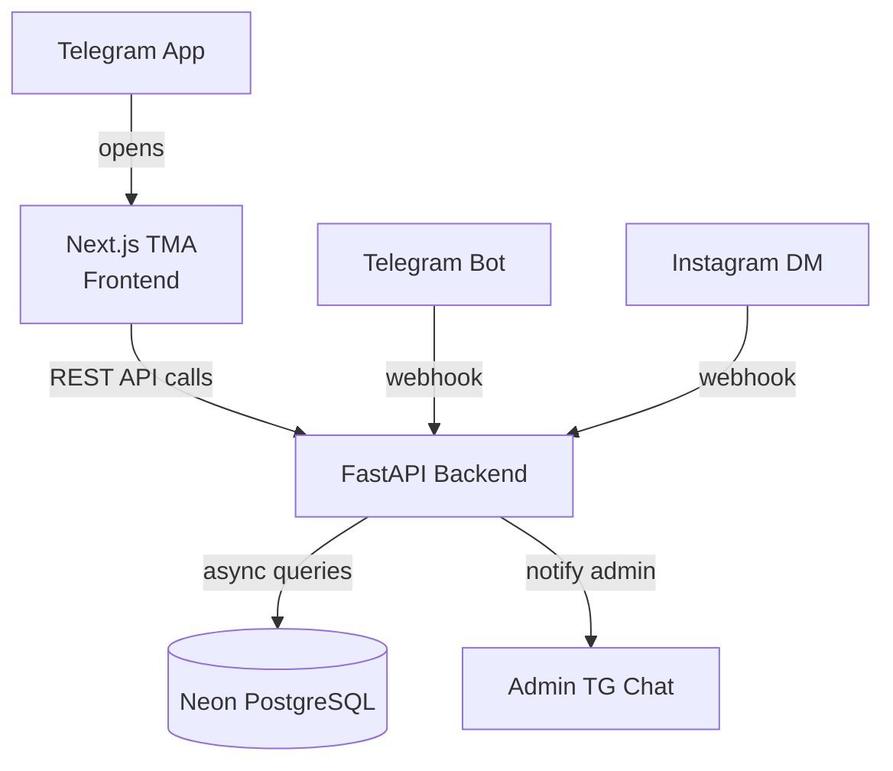

# OmniShop TMA — Project Walkthrough

## What Was Built

A production-ready, single-seller e-commerce system in a monorepo at:
📁 `/home/panha/snap/antigravity/5/.gemini/antigravity/scratch/omnishop/`

---

## Architecture

```
omnishop/
├── backend/     → FastAPI async REST API (Python)
└── frontend/    → Next.js 14 Telegram Mini App (TypeScript)
```



---

## Backend (`/backend`)

| File/Module | Purpose |
|---|---|
| `app/main.py` | FastAPI app factory, CORS, rate limiting, router mounting |
| `app/config.py` | Pydantic-settings config with `.env` support |
| `app/database.py` | Async SQLAlchemy engine + session factory |
| `app/models/` | SQLAlchemy ORM models: Seller, Product, Transaction, AutoResponse |
| `app/schemas/` | Pydantic v2 request/response schemas |
| `app/auth/` | Telegram `initData` HMAC validation + JWT creation |
| `app/api/v1/` | Route handlers: auth, products, transactions, webhooks |
| `app/services/` | Auto-responder, Telegram/Instagram messaging, admin notifications |
| `app/middleware/` | Token-bucket rate limiter (60 req/min; 10 on auth) |
| `alembic/` | Database migration setup |
| `tests/` | Pytest fixtures + auth/product tests |
| `.env.example` | Environment variable template |
| `Procfile` | `uvicorn` start command for Railway/Render |

### API Endpoints

| Method | Path | Auth | Description |
|---|---|---|---|
| `POST` | `/api/v1/auth/telegram` | — | Authenticate with Telegram initData |
| `GET` | `/api/v1/products` | — | List/search products (paginated) |
| `GET` | `/api/v1/products/{id}` | — | Get single product |
| `POST` | `/api/v1/products` | 🔒 Admin | Create product |
| `PUT` | `/api/v1/products/{id}` | 🔒 Admin | Update product |
| `DELETE` | `/api/v1/products/{id}` | 🔒 Admin | Soft-delete product |
| `POST` | `/api/v1/transactions` | 🔑 Buyer | Place order (decrements stock atomically) |
| `GET` | `/api/v1/transactions` | 🔒 Admin | List all orders (filterable by status) |
| `PATCH` | `/api/v1/transactions/{id}/status` | 🔒 Admin | Mark paid/cancelled (restores stock) |
| `POST` | `/api/v1/webhooks/telegram` | secret | Handle Telegram bot messages |
| `POST` | `/api/v1/webhooks/instagram` | HMAC | Handle Instagram DMs |
| `GET` | `/api/v1/webhooks/instagram` | — | Hub challenge verification |
| `GET` | `/health` | — | Health check |

---

## Frontend (`/frontend`)

| Component/Page | Purpose |
|---|---|
| `src/styles/globals.css` | Full design system — Telegram theme vars, glassmorphism, animations |
| `src/lib/telegram.ts` | Telegram WebApp API helpers + `triggerHaptic()` |
| `src/lib/api.ts` | Typed fetch client for all backend endpoints |
| `src/lib/auth.ts` | Auth state management (localStorage + JWT) |
| `src/components/Header.tsx` | Top nav with cart icon and back button |
| `src/components/ProductCard.tsx` | Glassmorphism product grid card |
| `src/components/CartDrawer.tsx` | Slide-in cart sidebar |
| `src/components/QuantitySelector.tsx` | +/- quantity control |
| `src/components/StatusBadge.tsx` | Coloured order status pill |
| `src/components/EmptyState.tsx` | Empty/error placeholder |
| `src/components/LoadingSkeleton.tsx` | Animated loading skeletons |
| `src/components/TelegramProvider.tsx` | Telegram WebApp init + auto-auth |
| `src/hooks/useProducts.ts` | Fetches + debounces product search |
| `src/hooks/useCart.ts` | Cart state with localStorage persistence |
| `src/hooks/useAuth.ts` | Auth state, auto-auth on mount |
| `src/app/page.tsx` | Storefront home: search, categories, product grid |
| `src/app/product/[id]/page.tsx` | Product detail with add-to-cart |
| `src/app/checkout/page.tsx` | Order review + submit (creates transactions) |
| `src/app/admin/layout.tsx` | Admin sidebar layout |
| `src/app/admin/page.tsx` | Admin dashboard with stats |
| `src/app/admin/products/page.tsx` | Product CRUD (create, edit, delete) |
| `src/app/admin/orders/page.tsx` | Order management (mark paid/cancel) |

---

## Getting Started

### 1. Backend Setup

```bash
cd omnishop/backend

# Create & activate virtual environment
python3 -m venv venv && source venv/bin/activate

# Install dependencies
pip install -e ".[dev]"

# Set up environment
cp .env.example .env
# Edit .env with your values

# Run migrations
alembic upgrade head

# Start server
uvicorn app.main:app --reload --port 8000
```

> **Note:** Visit http://localhost:8000/docs for interactive Swagger UI.

### 2. Frontend Setup

```bash
cd omnishop/frontend

# Install dependencies
npm install

# Set up environment
cp .env.local.example .env.local
# Edit .env.local: NEXT_PUBLIC_API_URL=http://localhost:8000

# Start dev server
npm run dev
```

> The app is available at http://localhost:3000

---

## Deployment

### Backend → Railway or Render

1. Connect your GitHub repo
2. Set **root directory** to `backend/`
3. Add all environment variables from `.env.example`
4. The `Procfile` auto-configures the start command
5. After deploy, register the Telegram webhook:
   ```bash
   curl "https://api.telegram.org/bot<TOKEN>/setWebhook?url=https://your-backend.up.railway.app/api/v1/webhooks/telegram&secret_token=<YOUR_WEBHOOK_SECRET>"
   ```

### Frontend → Vercel

1. Connect your GitHub repo
2. Set **root directory** to `frontend/`
3. Add env variable: `NEXT_PUBLIC_API_URL=https://your-backend.up.railway.app`
4. Framework auto-detected as Next.js
5. Register the Mini App URL in [@BotFather](https://t.me/BotFather) → Bot Settings → Menu Button

---

## Key Design Decisions

| Decision | Rationale |
|---|---|
| `output: 'export'` in Next.js | Static HTML/JS suitable for Telegram Mini App hosting |
| JWT in Authorization header + cookie | Works in both TMA (cookie) and direct API clients |
| Atomic stock decrement with check | Prevents overselling under concurrent orders |
| `triggerHaptic()` wrapper | Unified shorthand over the more verbose `hapticFeedback(type, style)` |
| Manual payment flow | Minimal friction for small sellers; no payment gateway needed |
| Keyword auto-responder | Instant answers to price/stock queries on Telegram & Instagram |

---

## Files Changed (Bug Fixes Applied)

- ✅ `useProducts.ts` — fixed `.items` unwrap from paginated response
- ✅ `telegram.ts` — added `triggerHaptic()` convenience wrapper
- ✅ `main.py` — fixed `app.mount` → `app.include_router`
- ✅ `app/api/__init__.py` — created missing package init
- ✅ `app/api/v1/__init__.py` — created missing package init
- ✅ `app/services/__init__.py` — created missing package init
- ✅ `app/middleware/__init__.py` — created missing package init
